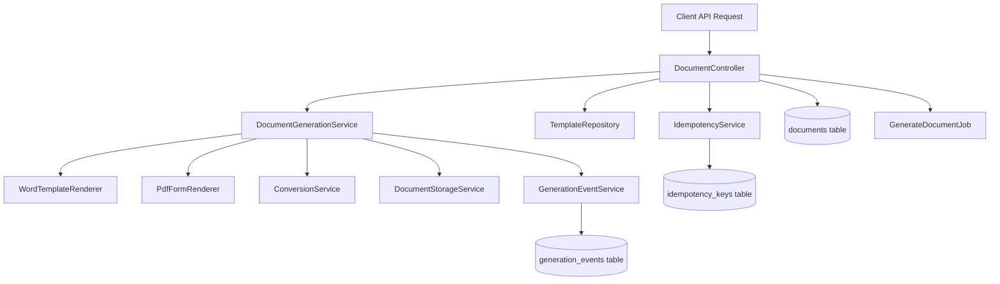
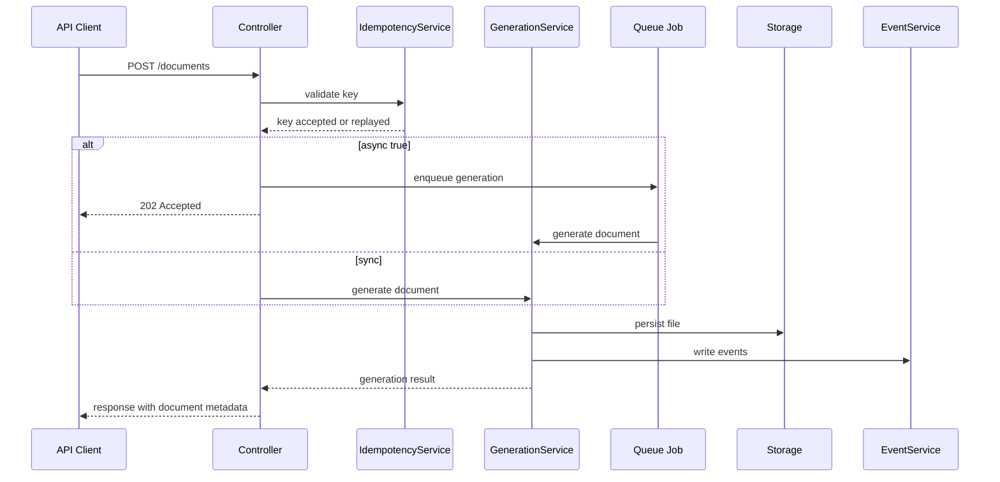

# Docit Architecture

## Problem statement

Most Laravel teams need to generate business documents such as contracts, employment letters, certificates, invoices, and forms. The common approach is HTML-to-PDF rendering, but this creates recurring operational issues:

- Legal and HR teams cannot safely maintain templates without engineering involvement.
- Print CSS drift causes production regressions.
- Browser-based rendering adds startup and memory overhead in batch jobs.
- Retries can generate duplicate documents when idempotency is missing.
- Teams lack a clear event trail for compliance and support.

Docit addresses this by treating document generation as a backend pipeline with template ownership by business teams and reliability controls for engineering teams.

## Architecture goals

- Generate DOCX and PDF outputs from business-owned templates.
- Support synchronous and queued asynchronous processing.
- Ensure safe retries with idempotency.
- Persist generation metadata and lifecycle events.
- Provide template inspection before production rollout.
- Keep API contracts stable across document types.

## Non-goals

- Pixel-perfect reproduction of dynamic web UI layouts.
- Replacing frontend page rendering engines.
- WYSIWYG editor concerns inside the package.

## System overview

## How the problem is solved

### 1. Template ownership problem

Problem:
Business teams depend on engineering for every wording/layout change in HTML templates.

Solution:
Docit uses DOCX/PDF templates as first-class inputs so legal and HR can update templates directly, while engineers only provide structured data payloads.

### 2. Duplicate generation on retry

Problem:
Network retries and queue retries can accidentally create duplicate files.

Solution:
Idempotency keys are persisted and checked before generation. Repeated requests with the same key resolve to the same operation outcome.

### 3. Batch reliability and scale

Problem:
High-volume runs often fail under synchronous request constraints.

Solution:
Docit supports queue-based async generation with configurable attempts, backoff, and timeout controls, enabling horizontal worker scaling.

### 4. Lack of traceability

Problem:
Support and compliance teams cannot explain generation failures or timing.

Solution:
Generation lifecycle events and document metadata are stored, making each request auditable from queued to completed or failed states.

### 5. Template drift and runtime surprises

Problem:
Template placeholder mismatches are discovered only in production.

Solution:
Template inspection endpoints validate placeholders/fields and surface warnings before production rollout.

## Processing pipelines

### Word template pipeline

1. Resolve best-matching versioned template.
2. Merge payload into DOCX placeholders.
3. Return DOCX directly or convert to PDF using LibreOffice.
4. Store generated artifact and metadata.
5. Record generation events.

### Fillable PDF pipeline

1. Resolve fillable PDF template.
2. Map payload keys to AcroForm field names.
3. Fill fields via pdftk.
4. Store generated artifact and metadata.
5. Record generation events.

## Request lifecycle

## Key package components

- src/Documents/Http/Controllers/DocumentController.php: API entry points for generation and retrieval.
- src/Documents/Services/DocumentGenerationService.php: Core orchestration of template resolution, rendering, conversion, and persistence.
- src/Documents/Services/WordTemplateRenderer.php: DOCX placeholder rendering.
- src/Documents/Services/PdfFormRenderer.php: Fillable PDF field injection.
- src/Documents/Services/ConversionService.php: DOC and DOCX conversion operations.
- src/Documents/Services/IdempotencyService.php: Request deduplication and replay safety.
- src/Documents/Services/GenerationEventService.php: Event persistence for traceability.
- src/Jobs/GenerateDocumentJob.php: Async execution path.

## Data model responsibilities

- documents table: document identity, status, file paths, metadata.
- templates table: discoverable versioned templates and descriptors.
- generation_events table: timeline of generation lifecycle events.
- idempotency_keys table: request deduplication and replay control.

## Operational guidance

- Run async mode for bulk jobs to avoid request timeouts.
- Use template versioning for controlled legal text rollouts.
- Keep binary dependencies pinned and monitored.
- Validate new templates with inspection endpoint before production release.

## Why this architecture is effective

Docit separates concerns cleanly:

- Business controls document language and layout.
- Engineering controls data contracts, retries, and observability.
- Operations controls worker scale and runtime policies.

This separation is the reason Docit stays maintainable as document volume and complexity grow.
