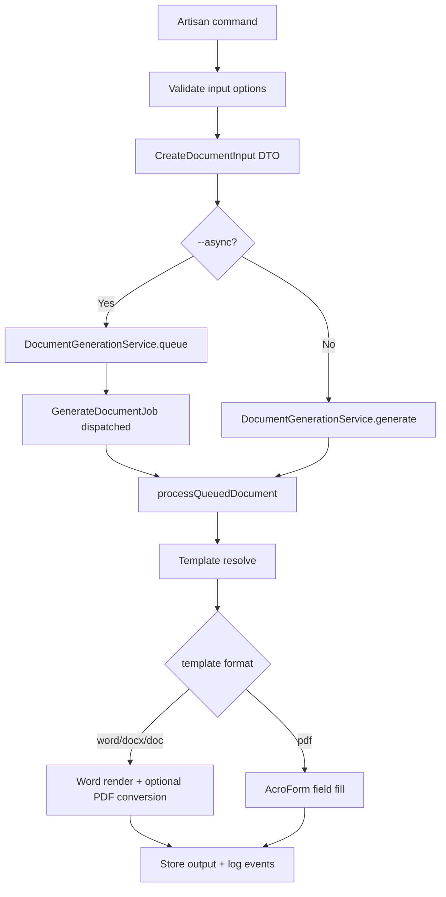

# CLI Commands and How They Work

This document explains command behavior for Docit package setup and host-level document generation commands.

## 1) Package-level commands (built into Laravel)

Docit relies on standard Laravel Artisan commands for setup.

### Publish config

```bash
php artisan vendor:publish --tag=document-config
```

What happens:

- `Yoosuf\Document\DocumentServiceProvider` publish map copies package config into your app:
  - source: `packages/yoosuf/document/config/document.php`
  - destination: `config/document.php`
- You can then tune API prefix, template/output directories, queue policy, and binary paths.

### Publish migrations

```bash
php artisan vendor:publish --tag=document-migrations
```

What happens:

- Package migration files are copied into your app migration directory.
- You control migration execution/versioning with normal Laravel workflow.

### Run migrations

```bash
php artisan migrate
```

What happens:

- Required persistence tables are created.
- Typical tables include:
  - documents
  - templates
  - generation_events
  - idempotency_keys
  - jobs

## 2) Host app CLI commands (example implementation)

This repository includes command wrappers in app code:

- `document:make-sample-invoice-template`
- `document:generate-document`

These are app commands, not part of package auto-registration.

### document:make-sample-invoice-template

```bash
php artisan document:make-sample-invoice-template
php artisan document:make-sample-invoice-template --path=storage/app/templates/invoice_v1.docx --force
```

Purpose:

- Generates a starter invoice DOCX template with placeholder tokens.

How it works:

1. Resolves target path from `--path` or defaults to templates directory.
2. Creates target directory if missing.
3. Refuses overwrite unless `--force` is provided.
4. Builds DOCX using PhpWord.
5. Writes template to disk.

### document:generate-document

```bash
php artisan document:generate-document invoice docx --template-format=word --data='{"invoice_number":"INV-1","customer_name":"Acme"}'
php artisan document:generate-document invoice pdf --template-format=word --sales-order-id=1001
php artisan document:generate-document invoice pdf --template-format=word --sales-order-id=1001 --async
```

Purpose:

- Generates a document via CLI using the same generation services as API endpoints.

Key options:

- Required arguments:
  - `document_type`
  - `output_format` (`docx|pdf`)
- Optional options:
  - `--template-format=` (`word|pdf`)
  - `--template-version=` (`v1`, `v2`, ...)
  - `--data=` JSON payload
  - `--data-file=` path to JSON file
  - `--sales-order-id=` integer ID (invoice source mode)
  - `--async` queue generation

Validation rules:

- Exactly one source mode must be provided:
  - data mode: `--data` or `--data-file`
  - sales order mode: `--sales-order-id`
- `--data` and `--data-file` cannot be used together.

## 3) Internal execution flow



## 4) Queue behavior for CLI async mode

When using `--async`, queue job behavior is governed by package config:

- attempts: `document.queue.attempts`
- backoff: `document.queue.backoff_seconds`
- max exceptions: `document.queue.max_exceptions`
- timeout seconds: `document.queue.timeout_seconds`

Run worker:

```bash
php artisan queue:work
```

## 5) Troubleshooting checklist

- Command not found:
  - ensure app command class exists and is autoloaded.
- Conversion failures:
  - verify `LIBREOFFICE_BINARY` path and permissions.
- PDF form fill failures:
  - verify `PDFTK_BINARY` path and PDF field names.
- Queue jobs not processing:
  - verify queue driver and worker process.
- Duplicate files after retry:
  - use idempotency key strategy in API-driven flows.

## 6) Recommended production CLI usage

- Use sync generation for low-latency single documents.
- Use async generation for payroll/bulk certificate batches.
- Keep payloads in versioned JSON files for reproducibility.
- Log command output and document IDs for audit traces.
